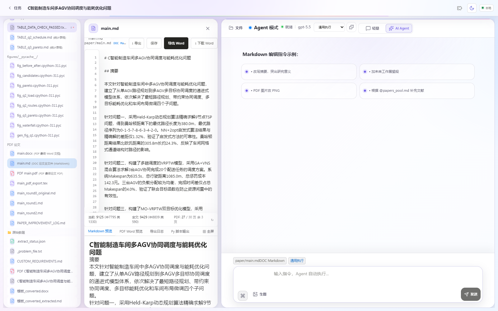
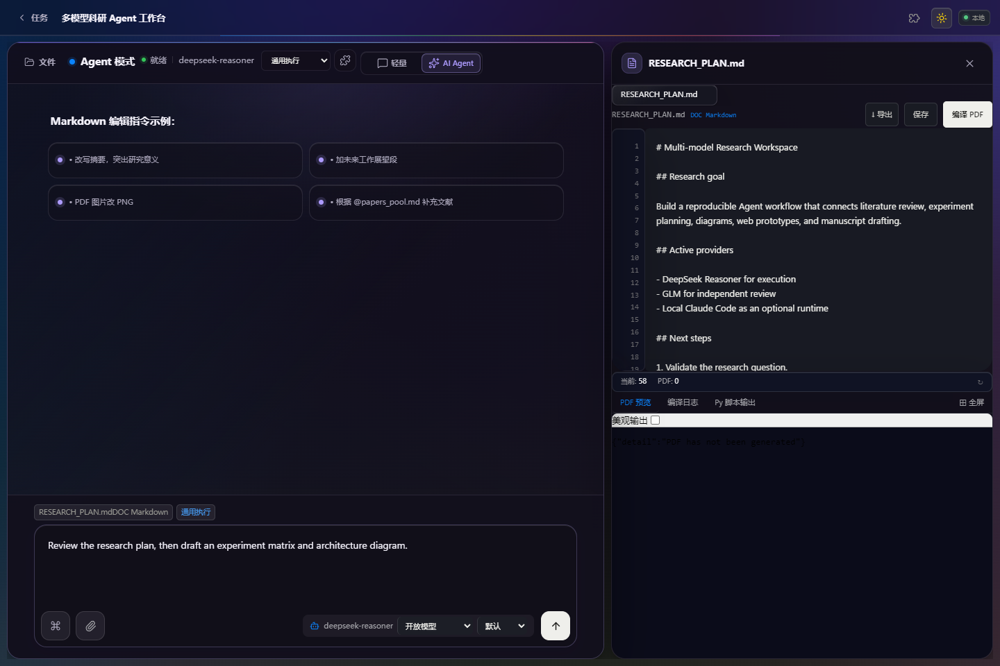
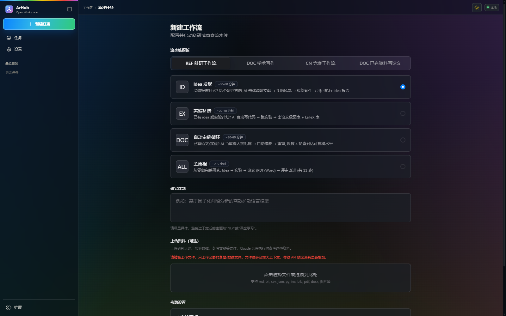
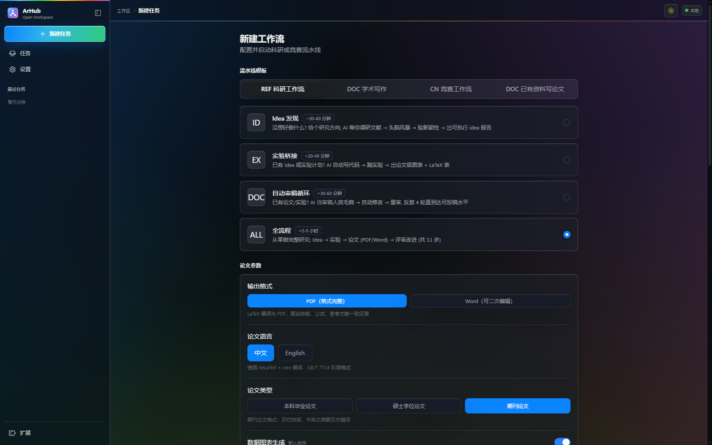
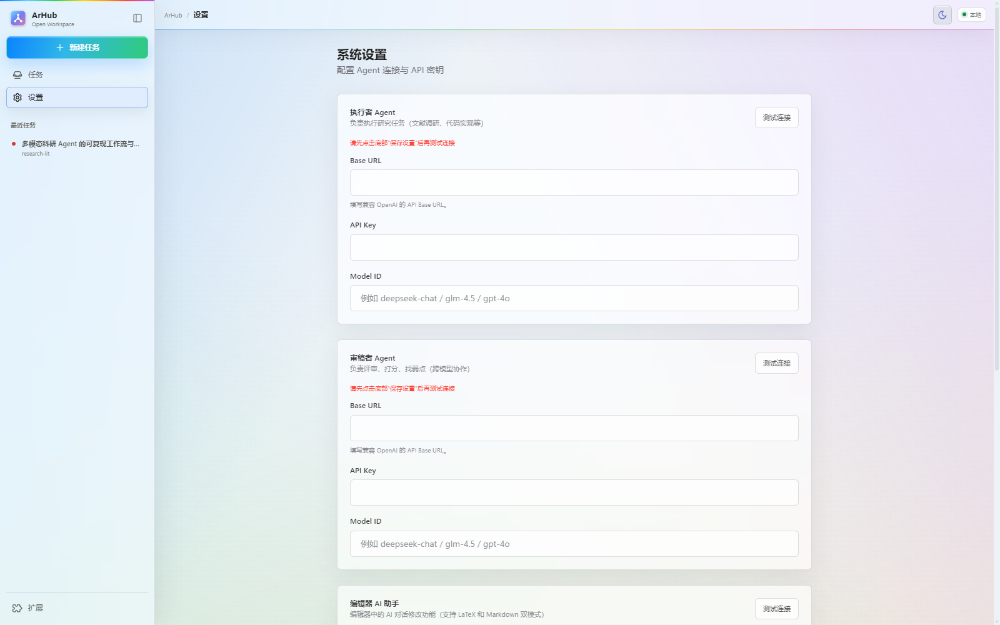

# ArHub

[](https://github.com/jiashuoyan0-maker/ArHub/actions/workflows/quality.yml)
[](https://github.com/jiashuoyan0-maker/ArHub/actions/workflows/codeql.yml)
[](LICENSE)

<p align="center">
  
</p>

<p align="center"><strong>把 Agent、文件、编辑器和工作流放回同一个任务现场。</strong></p>

ArHub（AI Research Hub）是一个面向科研写作、数据分析和工程任务的桌面 Agent
工作台，使用 Electron、FastAPI、OpenAI-compatible 模型接口和可扩展 Skill 工作流。

它不把 Agent 限制在一个孤立聊天框里。日常操作以对话为中心；当任务涉及文件、
产物或代码时，文件树、编辑器和预览会在当前工作区按需展开。执行过程中的步骤、
检查点、日志和产物会保留在任务中，方便继续运行、回看和审阅，而不是随着一段
聊天记录一起沉下去。



> [!NOTE]
> 本仓库由已安装应用的构建产物重建。后端、Agent、工作流、编辑器、状态层和
> 文档导出链路已经重写为可审查源码并可从源码运行；前端保留可运行的
> `dist/` 产物与恢复后的 `frontend-src/index.js`。原始 Vite 模块图仍未恢复；
> Windows 打包与发布链已经使用可审查配置重新建立。

## 界面预览

### Agent 与文档并排工作

Agent 对话是主工作区。打开文档后，Markdown/LaTeX 编辑器会在侧边展开，当前
文件会自动进入 Agent 上下文，不需要在聊天窗口、文件管理器和编辑器之间来回切换。



### 从单步任务到完整科研流水线

新建任务时可以选择 Idea 发现、实验桥接、自动审稿循环或完整流水线。模板负责
定义步骤与角色，参数仍由用户在启动前确认。



完整流水线可以继续设置输出格式、论文语言、论文类型和后续执行选项。运行状态、
检查点和产物会按任务持久化，中断后可以从已有状态继续。



### 每个 Agent 独立选择模型

执行者、审稿者和编辑器助手可以分别配置 Base URL、API Key 与 Model ID，适合用
不同模型承担执行、批判和写作任务。下图使用全新的空白演示配置，不包含凭证。



## 典型工作方式

1. 新建任务并选择工作流模板，或者从一个轻量 Agent 对话开始。
2. 为执行者、审稿者和编辑器助手选择各自的 OpenAI-compatible 模型。
3. Agent 调用 Skill 执行检索、分析、代码、绘图或文档生成，并把结果写入任务工作区。
4. 在当前对话旁打开产物，检查文件差异，再决定应用、丢弃或撤销修改。
5. 在检查点暂停、恢复或重跑单个步骤，而不必从头复制整段提示词。

## 当前状态

| 组成部分 | 状态 | 说明 |
|---|---|---|
| Electron 主进程 | 可审查源码 | `main.js`、`preload.js`、`updater.js` |
| FastAPI 后端 | 可运行源码 | 70 条应用路由，支持隔离数据目录和工作区边界 |
| Agent 与工作流 | 可运行源码 | provider-neutral 工具循环、检查点、暂停恢复和持久状态 |
| 编辑器 | 可运行源码 | Markdown/LaTeX、文件树、Agent diff/apply/undo、图片与脚本工具 |
| DOCX 与提取 | 可运行源码 | Node 高保真引擎、python-docx fallback、PDF/DOCX 文本提取 |
| 前端 | 恢复产物 | Codex 式动态工作台、亮暗主题；尚无可复现的模块化前端构建 |
| Skills 与扩展 | 明文可审查 | Skill、模板和声明式 profile 不需要激活或解密 |
| Windows 安装包 | 发布候选已验证 | 完整 runtime 锁、NSIS、签名范围隔离、SBOM、校验和、安装冒烟测试与 GitHub 发布工作流；正式产物必须使用可信证书 |

## 主要能力

- 为执行者、审稿者和编辑器分别配置模型与 API。
- 运行带检查点、产物管理和断点恢复的多步骤 Skill 工作流。
- 在 Agent 对话旁动态展开文件树、编辑器、预览和上下文。
- 审阅 Agent 文件差异，支持应用、丢弃和撤销。
- 导出 Markdown 为 DOCX，并预览 PDF、DOCX、Markdown 和图片。
- 通过声明式 manifest 扩展 Agent profile 与命令入口。

## 模型配置

三个 Agent 均接受以下 OpenAI Chat Completions 兼容地址：

- 服务根地址，例如 `https://api.deepseek.com`
- 带版本的兼容地址，例如 `https://open.bigmodel.cn/api/paas/v4`
- 完整的 `.../chat/completions` 地址

DeepSeek、GLM 和其他 OpenAI-compatible 服务可以使用同一连接层。模型 ID
必须填写为账号实际开放的 ID，例如 `deepseek-chat`、服务商提供的 GLM
模型 ID 或 `gpt-4o`。连接层遵循 `HTTP_PROXY`、`HTTPS_PROXY` 和
`NO_PROXY`。

内置 Agent 直接调用设置页中配置的模型接口，不依赖 Claude CLI。
`ClaudeRunner` 仅保留为兼容类名，Agent 本身没有被替换。不同服务商对
工具调用、视觉输入、上下文长度和 token 参数的支持不同，连接测试通过不代表
所有工作流能力完全一致。

API Key 只应保存在本机设置中。不要把 Key 写入仓库、截图、Issue 或日志。
任何曾在聊天或其他外部位置暴露的凭证都应在服务商控制台吊销并重新生成。

## 从源码运行

建议使用 Windows、Python 3.11 和 Node.js 20+。FastAPI 会同时托管
`dist/` 前端，因此无需单独启动前端开发服务器。

```powershell
py -3.11 -m venv .venv
.\.venv\Scripts\python.exe -m pip install -r backend\requirements.txt

$env:ARHUB_DATA_DIR = "$PWD\.arhub-data"
$env:ARHUB_API_PORT = "18088"
.\.venv\Scripts\python.exe -X utf8 -m uvicorn backend.main:app --host 127.0.0.1 --port 18088
```

启动后访问 [http://127.0.0.1:18088](http://127.0.0.1:18088)。

DOCX 的 Python fallback 随 `backend/requirements.txt` 安装即可使用。需要
公式与复杂排版能力时，再安装可选 Node 引擎依赖：

```powershell
npm --prefix tools\docx-cn-engine ci
```

## 开发与验证

```powershell
npm run check:js
npm run check:python
npm test
npm run audit:open-source
git diff --check
```

当前回归集包含 30 个 Python 测试和 9 个 Node 测试，覆盖模型 URL、LLM 请求、Agent 工具循环、工作流
状态、编辑器安全边界、diff/apply/undo、DOCX 导出和提取队列。发布候选还经过
真实浏览器验收，包括动态文件面板、Agent 工作区、亮色主题和 DOCX 预览。

## Windows 完整版

完整版安装包包含锁定的 Python、Node.js、Git、Pandoc、Draw.io 和 TeX
运行环境，用户无需另行安装这些工具。运行时版本、文件统计、关键文件哈希和
Python 包全集分别记录在 `packaging/runtime-manifest.json`、
`packaging/runtime-lock.json` 与 `packaging/python-requirements.lock.txt`。

`v1.0.9` 安装包约为 1.56 GiB，解压后的锁定运行时约为 6.52 GiB；建议安装前
至少预留 10 GiB 可用空间。安装器需要展开约 8.7 万个文件，在机械硬盘或启用
实时杀毒扫描的设备上可能连续数分钟不显示进度，请等待安装完成后再启动 ArHub。

本地安装器验证使用：

```powershell
npm ci
$env:ARHUB_RUNTIME_DIR = 'C:\path\to\verified\runtime'
npm run runtime:check
npm run package:win:unsigned
powershell -NoProfile -ExecutionPolicy Bypass -File scripts\smoke-test-installer.ps1 `
  -InstallerPath release\ArHub-Setup-1.0.9-x64-unsigned.exe -AllowUnsigned
```

未签名命令只生成文件名带 `-unsigned` 的本地测试件，且自动更新保持禁用。
正式 Release 默认强制可信 Authenticode 签名、时间戳、发布者匹配、SHA-256、
CycloneDX SBOM 和 GitHub 构建来源证明。签名配置及发布步骤见
[Windows 发布指南](docs/RELEASING.md)。

正式构建只使用 ArHub 证书签署主程序、更新提权助手、安装器和卸载器；打包后的
Python、Node.js、Git、Pandoc、Draw.io 与 MiKTeX 会再次按精确运行时锁验证，
不会覆盖上游厂商签名。每周维护任务检查 npm、后端与完整捆绑 Python 环境的
安全公告及完整运行时版本，Dependabot 负责 npm、pip 和 GitHub Actions 更新，
CodeQL 定期扫描 JavaScript 与 Python 源码。

## 数据目录

默认数据目录为 `%APPDATA%\ArHub`。源码开发和测试
建议设置 `ARHUB_DATA_DIR` 使用独立目录。数据库、日志、工作区、模型凭证和
用户扩展均不进入公开仓库。

声明式扩展注册表只读取 JSON manifest，不导入或执行第三方代码。未来若开放
可执行扩展，需要先建立权限声明、隔离和撤销机制。

## 仓库结构

| 路径 | 内容 |
|---|---|
| `backend/` | FastAPI 路由、状态、Agent、工作流和导出服务 |
| `dist/` | 当前运行使用的前端产物 |
| `frontend-src/` | 从 bundle 恢复的可读 JSX 源码 |
| `skills/` | 科研写作、分析、绘图和工作流 Skills |
| `extensions/` | 声明式 Agent profile 与扩展 manifest |
| `templates/`、`tools/` | 模板、DOCX 引擎与辅助工具 |
| `tests/` | 后端和核心行为回归测试 |
| `docs/recovery/` | 历史恢复证据与旧 API 表面，不代表当前实现状态 |

## 已知限制

1. 原始前端模块和 Vite 配置未恢复，修改 UI 时必须同步
   `frontend-src/index.js` 与 `dist/`。
2. `dist/` 仍是恢复得到的前端生产产物；安装包可以从已提交产物和锁定 runtime
   重建，但前端尚不能从模块化源码独立重建。
3. 三个旧字节码 DOCX helper 的原始源码无法恢复，但当前 DOCX 导出已由新的
   Node/Python 实现替代，不再依赖这些字节码。
4. provider-neutral 不等于 provider-identical；模型能力差异仍需按服务商验证。
5. 在可信代码签名证书和干净 Windows 安装验收完成前，不发布正式二进制 Release。

贡献前请阅读 [CONTRIBUTING.md](CONTRIBUTING.md)。安全问题请按
[SECURITY.md](SECURITY.md) 处理。第三方许可见
[THIRD_PARTY_NOTICES.md](THIRD_PARTY_NOTICES.md)。首次公开请遵循
[开源发布清单](docs/OPEN_SOURCE_RELEASE.md)。

## License

ArHub 自有代码使用 [MIT License](LICENSE)。第三方组件仍受各自许可证约束。
